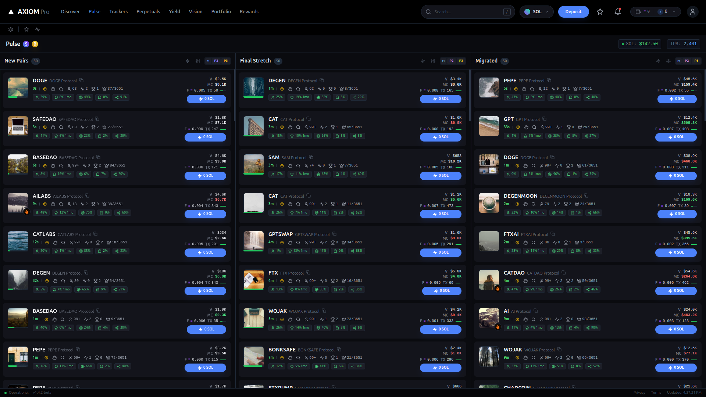

# Axiom Pulse Dashboard

A high-performance, real-time crypto token dashboard clone designed for tracking high-velocity token launches on Solana. This application features a pixel-perfect UI, complex data visualization, and simulated real-time WebSocket updates.



## ⚡ Core Features

### Real-Time Data Feed
- **Simulated WebSocket Layer:** Custom hooks simulate live price action, volume spikes, and market cap fluctuations.
- **Live Ticker Updates:** 3 distinct data columns (New Pairs, Final Stretch, Migrated) with independent update intervals.
- **Visual Feedback:** Color-coded price trends (green/red) and flash animations for new activities.

### Advanced UI/UX
- **Atomic Design System:** Reusable, typed components (TokenCard, Tooltip, Modal) built with Tailwind CSS.
- **Interactive Elements:** 
  - **Hover Previews:** detailed token snapshots on hover.
  - **Smart Tooltips:** Context-aware positioning with portals.
  - **Detail Modals:** Deep dive into token metrics.
- **Performance First:** Extensive use of `React.memo`, virtualized scrolling concepts, and efficient re-rendering strategies.
- **Skeleton Loading:** Smooth shimmer effects during data fetching states.

### Visual Polish
- **Aesthetics:** Dark mode optimized with "Glassmorphism" effects (blur, semi-transparent overlays).
- **Custom Iconography:** Bespoke SVG icon set including specific crypto indicators (Burn, Lock, Whale).
- **Responsive:** Fully adaptive layout that switches from a 3-column grid on desktop to a tabbed interface on mobile.

## 🛠 Tech Stack

- **Framework:** React 19
- **Language:** TypeScript (Strict Mode)
- **Styling:** Tailwind CSS
- **Icons:** Custom SVG Component System
- **State Management:** React Hooks (Context/Local State)
- **Build Tooling:** Standard ES Modules

## 📂 Project Structure

```
/
├── components/
│   ├── ui/             # Primitive UI components (ScrollArea)
│   ├── Icons.tsx       # Centralized SVG icon system
│   ├── Navbar.tsx      # Global navigation
│   ├── TokenCard.tsx   # Core data display component
│   ├── Tooltip.tsx     # Portal-based tooltip
│   └── ...
├── services/
│   └── mockData.ts     # Data generation & formatting utilities
├── types.ts            # TypeScript interfaces & definitions
├── App.tsx             # Main application layout & logic
└── index.tsx           # Entry point
```

## 🚀 Key Components

### `TokenCard`
The atomic unit of the dashboard. Handles:
- Displaying token metrics (Age, Market Cap, Volume).
- Rendering dynamic badges (Audit results, Top Holder stats).
- Managing hover states for previews.

### `useTokenData` (Hook)
Manages the application state and simulates network traffic.
- Generates initial datasets for 3 columns.
- Sets up intervals for random price updates to simulate market volatility.
- Handles "New Token" injection events.

## 🎨 Design System

- **Colors:** 
  - Background: `#0a0b0f` (Deep Void)
  - Card BG: `#13141b`
  - Accents: `#4c82fb` (Action Blue), `#22c55e` (Success Green), `#9945FF` (Solana Purple).
- **Typography:** Sans-serif system font stack optimized for legibility of dense numerical data.

## 🔧 Setup & Run

1. **Install Dependencies:**
   ```bash
   npm install
   ```

2. **Start Development Server:**
   ```bash
   npm start
   ```

---

*Built with precision.*
